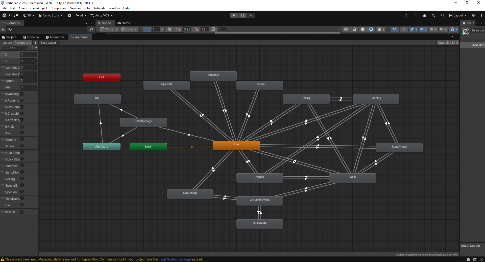

# Barbarians - Prova Inteligência Artificial 2026.2
Projeto desenvolvido por Samuel Santos Figueirêdo e Rafael Girardi
Universidade Estadual da Bahia (UNEB)

## Descrição
Cena 2D com o personagem escolhido através do sorteio em sala,
demonstrando comportamentos e estados controlados via Animator e Scripts C#.

## Personagem escolhido através do sorteio em sala:
•  Barbarian (jogador)

## Diagrama de Estados de Máquina:

*Figura 01 - Máquina de estados do Barbarian*

### Transições
**Estado inicial na gameplay:** `Idle`

| De | Para | Comando / Condição |
|---|---|---|
| Entry | Idle | Início do jogo |
| Idle | Walk | WASD |
| Idle | Running | Shift + WASD |
| Idle | Crouching | C |
| Idle | Attack | F |
| Idle | Kick | X |
| Idle | Scream | Q |
| Idle | Special1 | R (após Scream) |
| Idle | Special2 | T (após Scream) |
| Idle | JumpAttack | Espaço |
| Walk | Idle | Soltar WASD |
| Walk | Running | Shift + WASD |
| Walk | Crouching | C |
| Walk | JumpAttack | Espaço |
| Walk | Attack | F |
| Walk | Kick | X |
| Walk | Rolling | Shift + WASD + E |
| Running | Idle | Soltar Shift + WASD |
| Running | Walk | Soltar Shift |
| Running | Rolling | Shift + WASD + E |
| Running | JumpAttack | Espaço |
| Running | Kick | X |
| Crouching | CrouchingWalk | C + WASD |
| Crouching | Idle | Soltar C |
| CrouchingWalk | Crouching | Soltar WASD |
| CrouchingWalk | QuickSlide | C + WASD + V|
| QuickSlide | CrouchingWalk | Fim da animação |
| Rolling | Idle | Fim da animação |
| Attack | Idle | Fim da animação |
| Kick | Idle | Fim da animação |
| Scream | Idle | Fim da animação |
| Special1 | Idle | Fim da animação |
| Special2 | Idle | Fim da animação |
| JumpAttack | Idle | Fim do pulo |
| Any State | TakeDamage | Encostar em chama |
| TakeDamage | Idle | Fim da animação |
| Any State | Die | Vida = 0 (após 5 toques em chamas) |
| Die | Exit | Fim |
| Die | Idle | Espaço (reiniciar) |

# Comandos:
-	Walk (andar):		WASD
-	Running (correr):	Shift + WASD
-	Pulo com giro:		WASD (ou WASD + Shift) + E
-	Agachar:		C
-	Agachar e andar:	C + WASD
-	Deslizar:		C + WASD + V
-	Ataque:			F
-	Ataque e Pulo:		Espaço
-	Chute:			X
-	Receber Dano:		Encostar em alguma chama (Você tem 5 vidas)
-	Morrer:			Após encostar em 5 chamas. Aperte espaço para reiniciar.
-	Gritar (recarregar):	Q (Comando usado para carregar os estados de ataques especiais)
-	Ataque Especial 1:	R (Precisa ter o comando Gritar antes)
-	Ataque Especial 2:	T (Precisa ter o comando Gritar antes)

## Como jogar
• Jogue a última release no UnityPlay!
https://play.unity.com/en/games/edfe2fcd-87c3-4589-8282-f7dbcd2faba9/barbarian-ia-uneb-20262

• Acesse o código-fonte do projeto em:
https://github.com/DjTarma/IA---Barbarian-2026.2-